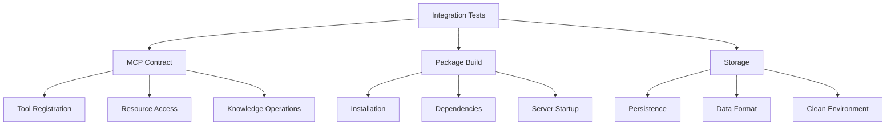

# System Patterns

## Testing Architecture

### Integration-First Testing
The project follows an integration-first testing approach, focusing on end-to-end functionality and MCP contract compliance rather than unit testing individual components.



### Test Organization

1. Integration Tests
   ```
   tests/
   ├── fixtures.py           # Shared test data and helpers
   └── integration/
       ├── test_mcp_contract.py    # MCP functionality
       └── test_package_build.py   # Installation verification
   ```

2. Test Fixtures
   ```python
   # Common test data
   TEST_KNOWLEDGE = {
       "path": str,
       "content": str,
       "metadata": dict
   }

   # Helper functions
   def assert_tool_response(...)
   def assert_resource_content(...)
   def assert_storage_exists(...)
   def add_test_knowledge(...)
   ```

3. Environment Management
   ```python
   @pytest.fixture(autouse=True)
   async def clean_storage():
       # Clean before test
       if TEST_STORAGE_DIR.exists():
           shutil.rmtree(TEST_STORAGE_DIR)
       
       yield
       
       # Clean after test
       if TEST_STORAGE_DIR.exists():
           shutil.rmtree(TEST_STORAGE_DIR)
   ```

### Test Patterns

1. MCP Contract Testing
   - Tool registration verification
   - Resource access patterns
   - Error handling
   - Response format validation

2. Package Verification
   - Clean installation
   - Dependency resolution
   - Server initialization
   - Basic functionality

3. Storage Testing
   - Data persistence
   - File format verification
   - Clean environment
   - Concurrent access

### Best Practices

1. Test Independence
   - Clean environment between tests
   - No shared state
   - Isolated storage
   - Independent test cases

2. Helper Functions
   - Common assertions
   - Test data management
   - Environment setup
   - Error validation

3. Test Organization
   - Clear test names
   - Focused test cases
   - Shared fixtures
   - Minimal duplication

4. Error Handling
   - Expected errors
   - Invalid operations
   - Resource cleanup
   - Clear error messages

### Implementation Requirements

1. Test Environment
   ```python
   # Storage directory
   TEST_STORAGE_DIR = Path("test_knowledge_store")
   
   # Server configuration
   embedder = OllamaEmbedder(base_url="http://localhost:11434")
   vector_store = PersistentVectorStore(storage_dir=TEST_STORAGE_DIR)
   ```

2. Test Data
   ```python
   # Knowledge entries
   {
       "path": "memory-bank/example.md",
       "content": "# Example Content...",
       "metadata": {
           "type": "memory_bank",
           "category": "example"
       }
   }
   ```

3. Assertions
   ```python
   # Response validation
   assert_tool_response(result, expected_data)
   
   # Content verification
   assert_resource_content(content, expected_content, expected_metadata)
   
   # Storage checks
   assert_storage_exists()
   ```

### Benefits

1. Quality Assurance
   - End-to-end verification
   - Contract compliance
   - Installation validation
   - Error detection

2. Maintenance
   - Clear test structure
   - Easy to update
   - Minimal dependencies
   - Focused testing

3. Development
   - Fast feedback
   - Clear expectations
   - Easy debugging
   - Reliable results
