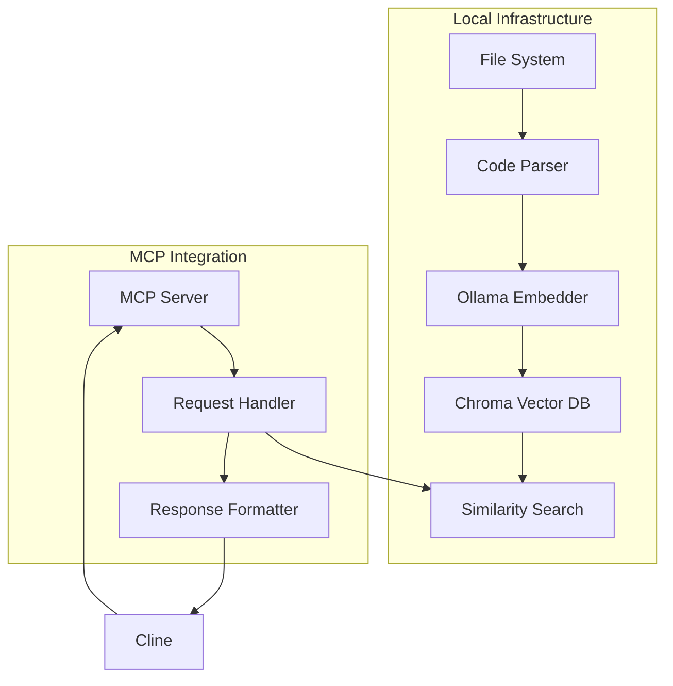

# System Patterns

## Architecture Overview

## Key Components

### 1. Code Parser
- Traverses local file system
- Reads code files
- Handles different file types
- Respects exclusion patterns

### 2. Embedding System
- Uses local Ollama service
- Generates consistent embeddings
- Maintains dimension compatibility
- Handles code semantics effectively

### 3. Vector Database
- Local Chroma instance
- Temporary storage per session
- Efficient similarity search
- Clean teardown after use

### 4. MCP Integration
- JSON interface compliant
- Standard error handling
- Clear response formatting
- Resource cleanup

## Design Patterns

### Command Pattern
Used in MCP tool interface to encapsulate requests and responses.

### Repository Pattern
Abstracts vector database operations and provides clean interface for searches.

### Factory Pattern
Creates appropriate parsers for different file types.

### Strategy Pattern
Allows for different embedding strategies if needed.

## Error Handling Strategy
1. Validation at entry points
2. Graceful degradation
3. Clear error messages
4. Proper resource cleanup
5. Error reporting via MCP protocol

## Performance Considerations
- Batch processing for embeddings
- Index optimization
- Memory management
- Response time optimization

## Security Measures
- Local-only operation
- Temporary storage
- Clean session cleanup
- Limited file system access
